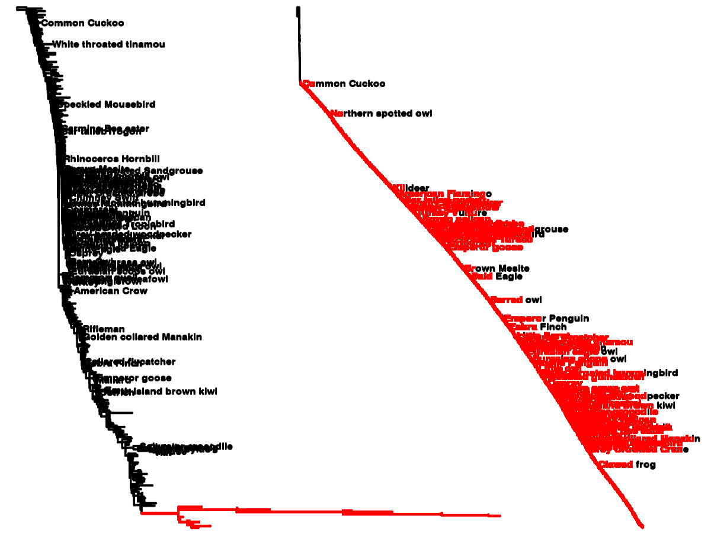

# Super\_distance &mdash; distance-based supertrees 
[](https://travis-ci.org/quadram-institute-bioscience/super_distance)
[](https://github.com/quadram-institute-bioscience/super_distance/blob/master/LICENSE)
[](https://hub.docker.com/r/leomrtns/super_distance)


This software implements a class of methods called **Matrix Representation with Distances** (MRD), with emphasis on whole gene families 
(i.e. gene trees that may contain paralogs) for species tree inference. 

Historically MRD was used in supertree
estimation for orthologous sets, but recently many patristic distance-based [methods](https://www.ncbi.nlm.nih.gov/pmc/articles/PMC4391732/), also called
[summary statistics methods](https://onlinelibrary.wiley.com/doi/full/10.1111/jse.12160) have been developed 
([NJst](https://doi.org/10.1093/sysbio/syr027),
[STEM](https://doi.org/10.1093/bioinformatics/btp079), 
[ASTRID](https://doi.org/10.1186/1471-2164-16-S10-S3), 
[STAR](https://arxiv.org/abs/1204.4413), etc.), and that can be applied to paralogous sets.
**Super_distance** implements all (or most) of them with a single call. 

The software is fast enough such that it can be added into workflows, and given a large set of input trees (that we call *gene
trees* or *gene families*) it produces a small set of output trees (*species trees*) that tries to summarise the
information in the input trees.  Currently it assumes newick files, and the two suggested ways of using it are:

1. If you have a list of all species names;
2. If all trees are on same leaf set, with very little missing data (the 'classic' MRD setting).

## Installation
### Conda
[](https://anaconda.org/bioconda/super_distance)
[](https://anaconda.org/bioconda/super_distance)
After you install [miniconda](https://conda.io/en/latest/miniconda.html), simply run
```[bash]
conda install -c bioconda super_distance
```

### From source
The instalation uses the autotools build system for compilation, and relies on the
[biomcmc-lib](https://github.com/quadram-institute-bioscience/biomcmc-lib) library, which can be downloaded
recursivelly:
```[bash]
/home/simpson/$ git clone --recursive git@github.com:quadram-institute-bioscience/super_distance.git
/home/simpson/$ (cd super_distance && ./autogen.sh)  ## notice the parentheses to avoid entering the directory
/home/simpson/$ mkdir build && cd build
/home/simpson/$ ../super_distance/configure --prefix=/usr/local
/home/simpson/$ make; sudo make install
```
As seen above, it is usually good idea to compile the code on a dedicated clean directory (`build`, in the example). 
The example above will install the `libsuper_distance` globally, in `/usr/local/lib`. 
If you don't have administrative (*sudo*) priviledges you can chose a local directory, by replacing the two last lines
with:
```[bash]
/home/simpson/$ ../super_distance-master/configure --prefix=/home/simpson/local
/home/simpson/$ make; make install
```
You can then run a battery of tests with
```[bash]
/home/simpson/$ make check
```
If you download the zip instead of git-cloning you will miss the the biomcmc-lib library, which is a submodule. In this
case please [download it](https://github.com/quadram-institute-bioscience/biomcmc-lib) and unzip it below `super_distance-master/`.

### Docker
After installing [Docker](https://www.docker.com/), you can install a docker container for `super_distance` with:
```[bash]
docker pull leomrtns/super_distance
```
And to use it you can run something like  
```[bash]
docker run --rm -it -v /path/to/data:/data leomrtns/super_distance sh -c 'super_distance -s /data/species_names.txt /data/gene*.tre'
```
Notice that the command we invoke is actually `sh`, to be able to use shell expansion; you are free to call
`super_distance` directly but in this case you must write all file names (thanks to [Andrea](https://github.com/telatin) for the trick!).
You may also prefer to first go to the working directory (`/path/to/data` in our example) and then run everything from
there &mdash; remember that docker can only access files mounted with `-v`:
```[bash]
docker run --rm -it -v /path/to/data:/data leomrtns/super_distance sh -c 'cd /data && super_distance -s species_names.txt gene*.tre'
```

### Galaxy
You can also install super_distance [from the Galaxy toolshed](https://testtoolshed.g2.bx.psu.edu/view/leomrtns/super_distance).

## Usage 
The program works better with a file with species names (more info below) and a list of the gene trees, in newick format. You can see
the options by running
```[bash]
/home/simpson/$ super_distance -h      ## OR
/home/simpson/$ super_distance --help  ## same as above
```
As seen above, all options have a short (one character) and a long version. Currently the available options are:
- **--epsilon (-e)** This is the minimum branch length on internodal distances; values smaller than this are considered to
  be multifurcations
- **--species (-s)** file name with the list of species names (optional, but strongly recommended)
- **--output (-o)** output filename with resulting supertrees (default is "-", which prints to screen)
- **--fast (-F)** Just two species trees are estimated, instead of all (36) of them.
- **--version (-v)** prints compiled version and exits
- all remaining arguments are assumed to be the names of gene files. 
The list above may be incomplete as the software is under development. Please run `super_distance -h` for an up-to-date
description. 

It will output many trees using all possible combinations of branch rescaling, clustering algorithms, and matrix merging
options. If option `--fast` was given, then only two trees are output, based on the UPGMA estimate of nodal distances
and of normalised branch lengths (more on methods below). Use this option if handling many species (tips on the
supertree). 

The algorithms expect input trees with branch lengths (since it estimates distances between leaves using individual branch
lengths), but the program works in their absence &mdash; although many output trees will be the same.
Some output trees will also be the same if there are no paralogs (since they use different strategies for paralog
distances resolution). 

### Mapping from genes to species
The input trees don't need to have information on all species, which is the classic supertree setting. 
They can also have the same species represented more than once, as when we have whole gene families with paralogs, 
and/or several samples from same species as in population genomics data sets. 
These trees with the same label for several leaves are called "multi-labelled trees", or simply *mul-trees*.
We use this term when we want to emphasise the distinction from classic supertrees approaches (where the objective was
to create a tree on the full set of taxa, from trees on subsets of it).
Super\_distance works as expected on the classic setting, by the way. 

Therefore, besides the input gene trees the program will request a file with a list of species names, which will provide
a mapping between leaves from the gene trees and leaves from the species tree.
This file is not needed but program may fail with no good explanation if you're not careful, see below.
The program tries to find the species name associated to each gene leaf by string matching, which means the gene tree
leaves must contain the species names. For instance if the list of species names is

```[bash]
Neisseria_elongata
Neisseria_gonorrhoeae
Neisseria_lactamica
Neisseria_meningitidis
Pseudomonas_aeruginosa
Pseudomonas_brassicacearum
Pseudomonas_chlororaphis
```

Then the following gene leaves would be mapped as:
```[bash]
__________________________________________________________________
|      gene leaf names           | species it will be mapped to  |
|--------------------------------|-------------------------------|
| Neisseria_elongata_001         | Neisseria_elongata            |
| Neisseria_elongata_002         | Neisseria_elongata            |
| COG001_Neisseria_gonorrhoeae   | Neisseria_gonorrhoeae         |  
| Neisseria_gonorrhoeae_COI2     | Neisseria_gonorrhoeae         |   
| Pseudomonas_chlororaphis       | Pseudomonas_chlororaphis      |   
| Pseudomonas_brassicacearum     | Pseudomonas_brassicacearum    |   
| Pseudomonas_brassica           | <<UNKNOWN>>                   | 
__________________________________________________________________
```
(at this point the program would complain that there is no species associated to gene leaf `Pseudomonas_brassica`. It is
OK with the unused species `Neisseria_lactamica`, however).

In the newick file it is valid to have several leaves with the same name, e.g. the species name, although most other software 
won't allow it.
Super_distance does not respect, however, spaces within a gene leaf or species names, despite these
agreeing with the [formal newick specification](http://evolution.genetics.washington.edu/phylip/newick_doc.html).
Since the list of species names will define the leaves of the output trees, the program may work even
in the presence of spaces, since it removes them from all input files.
In the future, and if it bothers enough people, we may implement automatic inference of species names. 

### Missing file with species names
The software works equally well in the absence of mul-trees, in which case the file with species names may not be
needed. 
In this situation, however, the software will not do extensive checks of name compliance &mdash; it will simply assume 
that the largest gene tree has _all_ species represented.

Therefore if not providing the list of species, please check that:

1. gene leaf names are comparable across genes: e.g. "ECOLI-a" and "ECOLI-b" are two different 'species' in the absence
   of a species name list; only the list could say that "ECOLI" is the species name.
2. most gene trees have info on all species: although the program can handle trees with missing species, you have to make
   sure that at least one tree has no missing species. And MRD is not particularly good with a lot of missing data.

In both cases, failure to do so will lead the program to fail without a helpful message (it may say something like `Couldn't find species for genes`). 

My suggestion is to use this option (without a list of species names) only if you are sure all trees are perfectly
comparable, i.e. if they are different runs of same tree inference software on same data, or bootstrap replicates, or a
sliding window inference... in any case make sure the leaf names are the same between trees.

### Moar data!

If the software estimates trees like the ones below, you may need to include more data in each tree.
The ladderised pattern with long branches may indicate lack of pairwise comparisons (when a pair of species are never
found together in the same gene tree). 



## Algorithms: distance-based, or MRD supertrees
Several distance-based are implemented. Multifurcating trees are allowed, since the polytomies are transformed into dicotomies of length zero. 

These methods are sometimes called "matrix representation with distances" (MRD), specially in the classic supertree
context (where we don't have mul-trees), and are a generalisation of the ASTRID, NJst, STAR, and a few others. 
What they all have in common is that 

  1. For each gene tree they create a matrix with 'patristic' distance between leaves
  2. If there are several leaves from same species (i.e. the gene tree is a mul-tree) then the average or the minimum over all
     possible patristic distances is taken as the species-wise distance between pairs
  3. Once they have one pairwise distance matrix per gene, they merge them into one matrix by taking the average or the
     minimum across genes (we use average only). 
  4. This overall distance matrix is then used by a clustering algorithm to estimate the species tree.

Some methods use rooted while others use unrooted trees; some use branch lengths while
others use just the internodal distances; some resolve conflicts by taking the average or the minimum distances, 
within or between gene trees; some use UPGMA and some use NJ to estimate the species tree; some rescale branch lengths
or the pairwise species matrix. 
To avoid a [Buridan's donkey situation](https://en.wikipedia.org/wiki/Buridan%27s_ass), we've implemented all possible
combinations, with a few caveats: 
  
  1. We only use the average, and not the minimum, between loci. Within a locus (gene) we use both the average and the
     minimum.
  2. We implemented both UPGMA and single-linkage clustering, besides the bioNJ implemenentation of the
     Neighbour-Joining algorithm. 
  3. When we rescale the gene trees, we scale back the final pairwise distance matrix, before the clustering step. This
     final scaling is based on the average over all genes, such that all supertrees should have easily interpretable lengths.
     The exception are species tree based on the internodal distances, where we use the total average pairwise distance matrix 
     to find the best branch lengths by least squares. 
  4. It is not uncommon to have a lot of missing information, for instance when two species are never seen together in
     the same gene. In this case we estimate their pairwise distance from species in common using the [ultrametric
     approach](http://dx.doi.org/10.1093/bioinformatics/bth211). As mentioned above, weird things may happen then.

As usual, some methods/combinations will make more sense than others. Currently the software reports a list of supertrees without any 
explanation about the method, probably due to my bias towards consilience and away from defending one setting over
another. This may change in future versions (the settings, not my view). 

## List of trees
As mentioned above, super\_distance can calculate several trees or just two. Here is a brief description of the actual
trees, focusing on the different choices of algorithms. For each gene tree, it rescales the branch lengths using 6 different approaches (A):

1. **nodal:** all branch lengths are assumed to be zero if smaller than _epsilon_ or one otherwise
2. **averaged:** branch lengths are divided by the average length, s.t. average length is one after rescaling
3. **unscaled:** original values are used
4. **resized:** each branch length is divided by the number of nodes, leading to new tree length (sum of all rescaled branches) being the
   average (original) branch length
5. **normalised:** branch lengths are divided the original tree length (sum of all branch lengths), s.t. new tree length
   is one. 
6. **bounded:** lengths are divided by smallest value higher than _epsilon_, s.t. new minimum is one. Branches shorter 
   than _epsilon_ are unchanged (and will look really small!)

The names above are just for discriminating the rescalings, and don't have a deep statistical interpretation. If
paralogs are found, then we can take the **mean** or the **minimum** over distances between same species pairs (B).
The resulting (rescaled) distance matrices are then averaged and the mean scaling factor is used to create a pairwise
distance matrix, which will be used by a clustering algorithm. This clustering algorithm can be
[bioNJ](https://www.ncbi.nlm.nih.gov/pubmed/9254330), [UPGMA](https://en.wikipedia.org/wiki/UPGMA), or [nearest
neighbour (NN)](https://en.wikipedia.org/wiki/Single-linkage_clustering), a.k.a. single-linkage clusteing (C). 

The combination of choices (A), (B), and (C) leads to 36 possible trees, which are, in order:

|            | NJ+mean | NJ+min | UPGMA+mean | UPGMA+min | NN+mean | NN+min |
-------------|---------|--------|------------|-----------|---------|--------|
| nodal      | D00     | D01    | D02        | D03       |D04      | D05    |
| averaged   | D06     | D07    | D08        | D09       |D10      | D11    |
| unscaled   | D12     | D13    | D14        | D15       |D16      | D17    |
| resized    | D18     | D19    | D20        | D21       |D22      | D23    |
| normalised | D24     | D25    | D26        | D27       |D28      | D29    |
| bounded    | D30     | D31    | D32        | D33       |D34      | D35    |

When "nodal" distances are used to estimate the tree (i.e. trees D00-D05) then the branch lengths will be estimated from
the final "averaged" matrix. 
If no paralogs are present, then all trees will be identical to one of their neighbours (e.g. D00 and D01). If the
_fast_ option is set (`-F`), then only tree D02 and D08 are output. 

## License 
Copyright (C) 2019-today  [Leonardo de Oliveira Martins](https://github.com/leomrtns)

super\_distance is free software; you can redistribute it and/or modify it under the terms of the GNU General Public
License as published by the Free Software Foundation; either version 2 of the License, or (at your option) any later
version (http://www.gnu.org/copyleft/gpl.html).

This software borrows many functions from the [guenomu software](https://bitbucket.org/leomrtns/guenomu/) for phylogenomic species tree inference and 
also extends functionality from [genefam-dist library](https://github.com/leomrtns/genefam-dist). It relies on the
low-level library [biomcmc-lib](https://github.com/quadram-institute-bioscience/biomcmc-lib), which is defined as a submodule &mdash; so don't forget to git recursively. 
